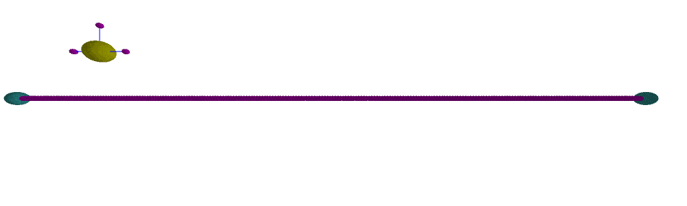

# **miPhysics**
# Mass-Interaction Physics in Java/Processing

**miPhysics** is a mass-interaction physical modelling library, coded in Java and designed for the *Processing* sketching environment.

Using elementary physical elements (such as masses, springs, contact interactions...) it allows modular design of any type of physical object for **visual generation**, **audio synthesis** or **haptic interaction** purposes - or even ***all three*** at the same time !


## 1 - Using miPhysics: Getting Started

To get the compiled version of the library for Processing, head to the release section and download it in ZIP format.

Then unzip the file and place the **"miPhysics"** folder in the Processing sketchbook "library" folder. 


### Prerequisites

Any up to date version of Processing should do the trick (the library is untested for processing v1).

### Installing

See above.

A few libraries are necessary to run the different examples (peasycam, minim, shapes3D, midiBus): you can obtain these from Processing's library manager.

## 2 - Running the examples

Open up the examples within the folder or in Processing's example browser and go crazy!

Examples are split into categories:

* **0_Basics**: start here if you have no idea what mass-interaction physical modelling is about. The simple examples should help understand how things work and how models can be coded in Processing.

* **1_Visuals**: some more elaborate models for generating visual behaviour, also showing some more advanced features (dynamic topology changes, grouped parameter modification, etc.)

* **2_Audio**: examples generating real-time sound synthesis with mass-interaction models. The code structure is a little different here (as the model runs in an audio thread, using the Minim library).

* **3_Haptics**: multi-sensory haptic interaction models! Some are purely haptic scenes, whereas others allow audio-haptic interaction with sound-producing virtual models (such as strings, etc.).

The Haptic examples require the Haply system. For information and installation requirements, see: [HaplyHaptics](https://github.com/HaplyHaptics)'s github page.




## 3 - A Simple Example Code


```java

/*
Model: Hello Mass

A physical equivalent to a Hello World program!

We create a mass, and attach it to six fixed points with spring-dampers.
We then simulate the model, and can trigger forces on the mass by hitting the space bar.
*/

import miPhysics.*;
import peasy.*;
PeasyCam cam;

int displayRate = 90;

float m = 1.0;
float k = 0.001;
float z = 0.01;
float dist = 70;

/*  global physical model object : will contain the model and run calculations. */
PhysicalModel mdl;

void setup() {
  frameRate(displayRate);
  size(1000, 700, P3D);
  cam = new PeasyCam(this, 100);
  cam.setMinimumDistance(100);
  cam.setMaximumDistance(500);

  mdl = new PhysicalModel(300, displayRate);

  /* Create a mass, connected to fixed points via Spring Dampers */
  mdl.addMass3D("mass", m, new Vect3D(0., 0., 0.), new Vect3D(0., 0., 1.));

  mdl.addGround3D("ground1", new Vect3D(dist, 0., 0.));
  mdl.addGround3D("ground2", new Vect3D(-dist, 0., 0.));
  mdl.addGround3D("ground3", new Vect3D(0., dist, 0.));
  mdl.addGround3D("ground4", new Vect3D(0., -dist, 0.));
  mdl.addGround3D("ground5", new Vect3D(0., 0., dist));
  mdl.addGround3D("ground6", new Vect3D(0., 0., -dist));

  mdl.addSpringDamper3D("spring1", dist, k, z, "mass", "ground1"); 
  mdl.addSpringDamper3D("spring2", dist, k*0.9, z, "mass", "ground2"); 
  mdl.addSpringDamper3D("spring3", dist, k*2, z, "mass", "ground3"); 
  mdl.addSpringDamper3D("spring4", dist, k*2.1, z, "mass", "ground4"); 
  mdl.addSpringDamper3D("spring5", dist, k*1.5, z, "mass", "ground5"); 
  mdl.addSpringDamper3D("spring6", dist, k*1.6, z, "mass", "ground6"); 

  mdl.init(); 
}

void draw() {
  directionalLight(251, 102, 126, 0, -1, 0);
  ambientLight(102, 102, 102);
  background(0);
  stroke(255);

  /* Calculate Physics */
  mdl.draw_physics();

  /* Draw the mass and the springs */
  PVector pos = mdl.getMatPVector("mass");
  line(pos.x, pos.y, pos.z, dist, 0, 0);
  line(pos.x, pos.y, pos.z, -dist, 0, 0);
  line(pos.x, pos.y, pos.z, 0, dist, 0);
  line(pos.x, pos.y, pos.z, 0, -dist, 0);
  line(pos.x, pos.y, pos.z, 0, 0, dist);
  line(pos.x, pos.y, pos.z, 0, 0, -dist);
  translate(pos.x, pos.y, pos.z);
  sphere(15);
}

/* Trigger random forces on the mass */
void keyPressed() {
  if (key == ' ')
    mdl.triggerForceImpulse("mass",random(-5,5),random(-5,5),random(-5,5));
}

```

## 4 - Developping miPhysics

If you would like to manually build or work on the miPhysics library, clone or fork the github repository.

The library is currently built using Intellij IDEA (Ant build & automatic Javadoc generation), based on a template for developping Processing libraries.
Building with Eclipse should also be possible (cf. guidelines below).


### Using the library outside of Processing

It is also possible to use the .jar library outside of Processing. So far, this has been tested in Max/MSP (using the MXJ system) but is not yet documented.

### Contributing

We'd be happy to involve more coders in developping the library further, extending functionnalities and debugging. Feel free to fork the repo, suggest pull requests, etc.


If you have created models that you would like to see integrated into the library examples, get in touch!


## 5 - Authors

This project was developped by James Leonard and Jérôme Villeneuve.

For more info, see: www.mi-creative.eu

## 6 - License

This project is licensed under the GNU GENERAL PUBLIC LICENSE - see the [LICENSE](LICENSE) file for details

## 7 - Acknowledgments

This work implements mass-interaction physical modelling, a concept originally developped at ACROE - and now widely used in sound synthesis, haptic interaction and visual creation.

-----

# **Guidelines for developping Processing libraries**


***Below***: guidelines for importing the project into Eclipse (from the template used to build this library).

## Import to Eclipse

There are two options to import the template project into Eclipse: using a Git [fork](https://help.github.com/articles/fork-a-repo) or using a downloaded package. If you are not familiar with Git or GitHub, you should opt for the downloaded package.

### Option A: GitHub

1. Fork the template repository to use as a starting point.
  * Navigate to https://github.com/processing/processing-library-template in your browser.
  * Click the "Fork" button in the top-right of the page.
  * Once your fork is ready, open the new repository's "Settings" by clicking the link in the menu bar on the right.
  * Change the repository name to the name of your Library and save your changes.
  * NOTE: GitHub only allows you to fork a project once. If you need to create multiple forks, you can follow these [instructions](https://beeznest.wordpress.com/2013/12/26/creating-multiple-forks-using-upstream-branches/).
1. Clone your new repository to your Eclipse workspace.
  * Open Eclipse and select the File → Import... menu item.
  * Select Git → Projects from Git, and click "Next >".
  * Select "URI" and click "Next >". 
  * Enter your repository's clone URL in the "URI" field. The remaining fields in the "Location" and "Connection" groups will get automatically filled in.
  * Enter your GitHub credentials in the "Authentication" group, and click "Next >".
  * Select the `master` branch on the next screen, and click "Next >".
  * The default settings on the "Local Configuration" screen should work fine, click "Next >".
  * Make sure "Import existing projects" is selected, and click "Next >".
  * Eclipse should find and select the `processing-library-template` automatically, click "Finish".
1. Rename your Eclipse project.
  * In the Package Explorer, right-click (ctrl-click) on the folder icon of the `processing-library-template` project, and select Refactor → Rename... from the menu that pops up. 
  * Give the project the name of your Library, and click "OK".
  
### Option B: Downloaded Package

1. Download the latest Eclipse template from [here](https://github.com/processing/processing-library-template/releases). **Don't unzip the ZIP file yet.**
1. Create a new Java project in Eclipse. 
  * From the menubar choose File → New → Java Project. 
  * Give the project the name of your Library. 
  * Click "Finish".
1. Import the template source files.
  * Right-click (ctrl-click) onto the folder icon of your newly created project in the Package Explorer and select "Import..." from the menu that pops up. 
  * Select General → Archive File, and click "Next >".
  * Navigate to the ZIP file you downloaded earlier in step 1, and click "Finish".

## Set Up and Compile

1. Add Processing to the project build path.
  * Open your project's "Properties" window. 
  * Under "Java Build Path", select the "Libraries" tab and then "Add External JARs...". 
  * Locate and add Processing's `core.jar` to your build path. It is recommended that a copy of `core.jar` is located in your Eclipse workspace in a `libs` folder. If the `libs` folder does not exist yet, create it. Read the [section below](#AddingJARs) regarding where to find the `core.jar` file.
  * Confirm the setup with "OK".
1. Edit the Library properties.
  * Open the `resources` folder inside of your Java project and double-click the `build.properties` file. You should see its contents in the Eclipse editor. 
  * Edit the properties file, making changes to items 1-4 so that the values and paths are properly set for your project to compile. A path can be relative or absolute.
  * Make changes to items under 5. These are metadata used in the automatically generated HTML, README, and properties documents.
1. Compile your Library using Ant.
  * From the menu bar, choose Window → Show View → Ant. A tab with the title "Ant" will pop up on the right side of your Eclipse editor. 
  * Drag the `resources/build.xml` file in there, and a new item "ProcessingLibs" will appear. 
  * Press the "Play" button inside the "Ant" tab.
1. BUILD SUCCESSFUL. The Library template will start to compile, control messages will appear in the console window, warnings can be ignored. When finished it should say BUILD SUCCESSFUL. Congratulations, you are set and you can start writing your own Library by making changes to the source code in folder `src`.
1. BUILD FAILED. In case the compile process fails, check the output in the console which will give you a closer idea of what went wrong. Errors may have been caused by
  * Incorrect path settings in the `build.properties` file.
  * Error "Javadoc failed". if you are on Windows, make sure you are using a JDK instead of a JRE in order to be able to create the Javadoc for your Library. JRE does not come with the Javadoc application, but it is required to create Libraries from this template.

After having compiled and built your project successfully, you should be able to find your Library in Processing's sketchbook folder, examples will be listed in Processing's sketchbook menu. Files that have been created for the distribution of the Library are located in your Eclipse's `workspace/yourProject/distribution` folder. In there you will also find the `web` folder which contains the documentation, a ZIP file for downloading your Library, a folder with examples as well as the `index.html` and CSS file.

To distribute your Library please refer to the [Library Guidelines](https://github.com/processing/processing/wiki/Library-Guidelines).

## Source code

If you want to share your Library's source code, we recommend using an online repository available for free at [GitHub](https://github.com/).

## <a name='AddingJARs'/>Adding core.jar and other .jar files to your classpath</a>

The `core.jar` file contains the core classes of Processing and has to be part of your classpath when building a Library. On Windows and Linux, this file is located in the Processing distribution folder inside a folder named `lib`. On Mac OS X, right-click the Processing.app and use "Show Package Contents" to see the guts. The `core.jar` file is inside Contents → Resources → Java. For further information about the classes in `core.jar`, you can see the source [here](http://code.google.com/p/processing/source/browse/trunk/processing#processing/core) and the developer documentation [here](http://processing.googlecode.com/svn/trunk/processing/build/javadoc/core/index.html).

If you created a `libs` folder as described above, put the libraries you need to add to your classpath in there. In the "Properties" of your Java project, navigate to Java Build Path → Libraries, and click "Add External JARs...". Select the `.jar` files from the `libs` folder that are required for compiling your project. Adjust the `build.xml` file accordingly.

The `libs` folder is recommended but not a requirement, nevertheless you need to specify where your `.jar` files are located in your system in order to add them to the classpath.

In case a Library depends on system libraries, put these dependencies next to the `.jar` file. For example, Processing's `opengl.jar` Library depends on JOGL hence the DLLs (for Windows) or jnilibs (for OS X) have to be located next to the `opengl.jar` file.

## What is the difference between JDK and JRE?

JDK stands for Java Development Kit whereas JRE stands for Java Runtime Environment. For developers it is recommended to work with a JDK instead of a JRE since more Java development related applications such as Javadoc are included. Javadoc is a requirement to properly compile and document a Processing Library as described on the guidelines page.

You can have both a JDK and a JRE installed on your system. In Eclipse you need to specify which one you want to use.

## The JRE System Library

This primarily affects Windows and Linux users (because the full JDK is installed by default on Mac OS X). It is recommended that you use the JDK instead of a JRE. The JDK can be downloaded from [Oracle's download site](http://www.oracle.com/technetwork/java/javase/downloads/index.html). Also see the [Java Platform Installation page](http://www.oracle.com/technetwork/java/javase/index-137561.html), which contains useful information.

To change the JRE used to compile your Java project:

1. Open the properties of your project from the menu Project → Properties. Select "Java Build Path" and in its submenu, click on the "Libraries" tab.
1. A list of JARs and class folders in the build path will show up. In this list you can find the JRE System Library that is used to compile your code. Remove this JRE System library.
1. Click "Add Library...". In the popup window, choose "JRE System Library" and press "Next".
1. Select an alternate JRE from the pull-down menu or click and modify the "Installed JREs". Confirm with "Finish" and "OK". 

## Compiling with Ant and javadoc

Ant is a Java-based build tool. For [more information](http://ant.apache.org/faq.html#what-is-ant) visit the [Ant web site](http://ant.apache.org/). Ant uses a file named `build.xml` to store build settings for a project.

Javadoc is an application that creates an HTML-based API documentation of Java code. You can check for its existence by typing `javadoc` on the command line. On Mac OS X, it is installed by default. On Windows and Linux, installing the JDK will also install the Javadoc tool. 
